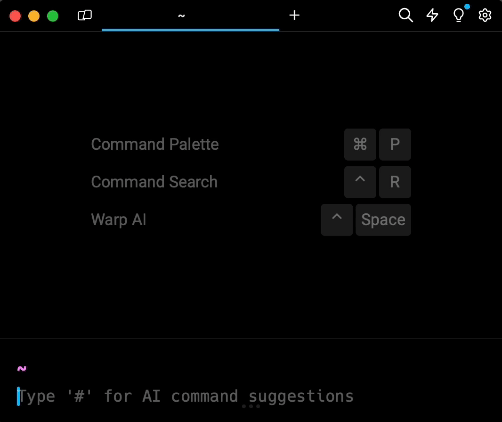

Recientemente he estado trabajando en algunos proyectos de prueba con .NET usando una Macbook Air M2 con macOS Sonoma. En este ambiente de trabajo, solo instalé [Visual Studio Code](https://code.visualstudio.com/) y [.NET 8](https://dotnet.microsoft.com/es-es/download/dotnet/8.0).

Para poder crear proyectos, compilarlos, ejecutarlos y publicarlos he estado usando .NET desde la CLI (command-line interface o interfaz de la línea de comandos). Para ello, es necesario abrir la terminal del sistema operativo (o usar alguna de terceros), invocar al controlador genérico **dotnet** y enviarle el nombre del comando con sus opciones para ejecutarlo.

La sintaxis de uso de la CLI de .NET sería similar a la siguiente:

```showLineNumbers title="CLI de .NET"
dotnet <comando> <opciones>
```

Por ejemplo: yo he estado usando la terminal llamada [Warp](https://www.warp.dev/). Para conocer la versión de .NET que tengo instalada y su ubicación invocaré el controlador dotnet con las opciones **version** e **info** de la siguiente manera:



## Ventajas de usar la CLI
--------------------------

* Eficiencia:
    * Automatización: Puedes crear scripts para automatizar tareas repetitivas, liberando tiempo para que te concentres en tareas más creativas e importantes.
    * Ejecución rápida: Los comandos de la CLI se ejecutan instantáneamente, lo que te permite trabajar de forma más rápida y fluida.
    * Navegación rápida: Puedes navegar por tu proyecto y acceder a los archivos que necesitas de forma rápida y eficiente.

* Productividad:
    * Menos distracciones: La CLI te permite trabajar en un entorno libre de distracciones, lo que te ayuda a concentrarte y ser más productivo.
    * Mayor control: Tienes un control más preciso sobre tu entorno de desarrollo y puedes personalizarlo a tus necesidades.
    * Menos errores: La CLI te obliga a ser más preciso en tus comandos, lo que puede ayudarte a reducir la cantidad de errores en tu código.

* Flexibilidad:
    * Acceso a herramientas: Puedes acceder a una amplia gama de herramientas y utilidades que no están disponibles en IDEs gráficos.
    * Trabajar en cualquier lugar: Puedes usar la CLI en cualquier lugar que tengas acceso a un terminal, incluso sin una conexión a internet.
    * Personalización: Puedes personalizar la CLI para que se adapte a tu estilo de trabajo y necesidades específicas.
    * Disponibilidad: La CLI puede ser usada en sistemas operativos Windows, macOS y Linux.

* Aprendizaje:
    * Profundizar en el funcionamiento de .NET: La CLI te permite comprender mejor cómo funciona .NET a un nivel más profundo.
    * Desarrollar habilidades de scripting: Puedes aprender a crear scripts que te ayuden a automatizar tareas y ser más eficiente.
    * Ser un mejor desarrollador: El uso de la CLI te puede convertir en un desarrollador más versátil y con más recursos.

A continuación, te comparto los comandos que he estado usando y que podrían ser de utilidad para tu primer acercamiento con la plataforma .NET.

## Comandos
-----------
### dotnet

Para revisar si tenemos instalado .NET en el equipo y consultar la versión, se puede utilizar la opción **version** o la opción **info**. Para obtener más ayuda del controlador dotnet se puede usar la opción **help**.

```showLineNumbers title="CLI de .NET"
dotnet --version
dotnet --info
dotnet --help
```

### new

El comando **new** es utilizado para crear un nuevo proyecto, archivo de configuración o solución, dependiendo de la plantilla que se le indique como argumento.

Para crear un proyecto de aplicación de consola, se utiliza la plantilla **console**:

```showLineNumbers title="CLI de .NET"
dotnet new console
```

Para crear un proyecto de API web de ASP.NET Core, se utiliza la plantilla **webapi**, se le especifica el nombre *API* y se le indica que usará la opción *use-controllers* para que agregue los modelos y controladores:

```showLineNumbers title="CLI de .NET"
dotnet new webapi -n API --use-controllers
```

Para crear un proyecto de MAUI (Multi-platform App UI), se utiliza la plantilla **maui** (la cual se descarga cuando se instala la carga de trabajo **maui**):

```showLineNumbers title="CLI de .NET"
dotnet new maui
```

Para tener acceso a la ayuda del comando se puede usar la opción **help**:

```showLineNumbers title="CLI de .NET"
dotnet new --help
```

### workload

El comando **workload** permite trabajar con cargas de trabajo de .NET.

La opción **install** instala una carga de trabajo indicada. Por ejemplo, para instalar la carga de trabajo **maui**:

```showLineNumbers title="CLI de .NET"
dotnet workload install maui
```

Para mostrar información sobre las cargas de trabajo instaladas:

```showLineNumbers title="CLI de .NET"
dotnet workload --info
```

Para tener acceso a la ayuda del comando se puede usar la opción **help**:

```showLineNumbers title="CLI de .NET"
dotnet workload --help
```

### run

El comando `run` permite ejecutar el código fuente. Se puede usar de la siguiente manera:

```showLineNumbers title="CLI de .NET"
dotnet run
```

Para tener acceso a la ayuda del comando se puede usar la opción **help**:

```showLineNumbers title="CLI de .NET"
dotnet run --help
```

### build

El comando **build** compila el código fuente y todas sus dependencias.

Para compilar un proyecto maui y ejecutarlo sobre el framework .NET 8 bajo la plataforma de macOS:

```showLineNumbers title="CLI de .NET"
dotnet build -t:Run -f net8.0-maccatalyst  
```

Para tener acceso a la ayuda del comando se puede usar la opción **help**:

```showLineNumbers title="CLI de .NET"
dotnet build --help
```

### publish

El comando **publish** se utiliza para publicar la aplicación y sus dependencias en una carpeta. Estos archivos pueden ser desplegados en un servidor posteriormente.

Para publicar un proyecto de tipo API web de ASP.NET Core:

```showLineNumbers title="CLI de .NET"
dotnet publish  
```

## Importante

Para que la mayoría de los comandos anteriores funcione, es necesario cambiar la carpeta de trabajo de la terminal a la ruta en la que se encuentra nuestro proyecto de .NET. 

Para ello, podemos usar el comando **ls** (list) o **dir** (dependiendo del Sistema Operativo) para listar los archivos y carpetas de la carpeta de trabajo y el comando **cd** (change directory) para  "entrar" o "salir" de una carpeta. 

Si usamos Visual Studio Code, su terminal se iniciará automáticamente en la carpeta que se abra.